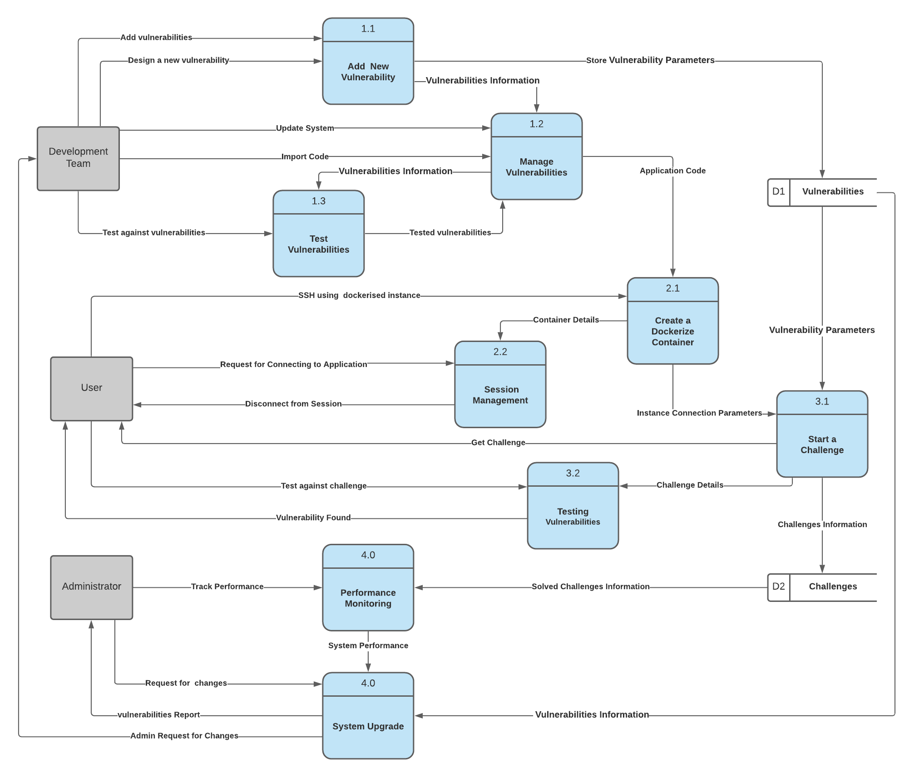

Link to Trello Board:
 https://trello.com/b/QnpZosBC/leaky-flask

Navigate here to see deployed application:  http://3.88.53.207:4000/

**R1)**

**Description of your website, including:**

**- Purpose**

**- Functionality / features**

**- Target audience**

**- Tech stack**

**Purpose** :

 The purpose of this application is to have a flask application intentionally vulnerable to a number of different exploitations, especially those commonly found in Flask or Django applications.

Many intentionally vulnerable applications already exist such as DVWA, Mutillidae, Juice Shop, and Web Goat, among others. However, most of these are built on PHP or Java, with a distinct lack of vulnerable applications built on Python frameworks. This is a problem because different frameworks have different inherent vulnerabilities. For example, Flask and Django are commonly vulnerable to Server Side Template Injections (SSTI) which are less common in PHP applications and, therefore, rarely feature in any of the existing intentionally intentionally vulnerable applications.

 Having researched Flask vulnerabilities, I found that it is very very easy for developers to misconfigure their application in a seemingly irrelevant way which can have immense implications. In fact, some commonly used libraries used in Flask are inherently vulnerable and should be avoided completely, and yet remain prevalent.

 This application should help raise awareness of these misconfigurations for developers, and allow for penetrations testers and exploit developers to further their skills against Flask applications.

**Functionality and Features:**

This application will have a number of unique features which assist in its practicality as well as ease of use.

First, as described above, it will have a number of challenges where users are tasked with exploiting a certain vulnerability. Currently challenges involves SQL injections, Server Side Template Injections, XML External Entity attacks, and insecure session cookies have already been crafted. These are presented in formats that reflect how they naturally occur online. For example, the challenges involve exploiting login screens, e-commerce pages, One-Time-Password authentication, and blog pages. Further formats and exploit types will likely be added later.

 One unique feature not often seen on other vulnerable applications is each challenge&#39;s link to a short blog post explaining why the application is vulnerable to this particular attack, showing the snippets of code responsible for the vulnerability, and explaining how to attack and defend against these vulnerabilities.

In addition to the above, a major goal of this project is to make it more accessible. Typically vulnerable web applications such as DVWA or Juice shop require that you download them locally, or use a special VPN connection to connect to them. This is to mitigate any risks associate with users attacking one another. This project aims to be hosted online, and to address these concerns by allocating users with an individual dockerized container, to isolate users from one another. These virtualised instances be be created once a user connects to the server.

 An additional feature to the above is that once the user disconnects from their virtualised instance, none of the data will be saved. This ensures that, first, the user is able to reset their environment if they want to start a fresh challenge and, second, that there is not a huge build up of saved data overpowering the server.

Creating the virtualised instances will require users to SSH in. This is reminiscent of a platform such as Over-The-Wire. However, this web application is designed in a way that these SSH instances allow for graphical user interfaces of the web application. This is opposed to challenges such as Over-The-Wire that only allow use of the command line. This ensures the best of both worlds with sessions that are isolated and available online, like Over-The-Wire, while still being interactive, such as Juice Shop which is not web-facing but has website functionality.

**Target Audience**

Vulnerable applications have a wide target audience. This involves both professionals in cyber security and web development, as well as individuals still learning the fundamentals of exploitation. This audience can be further subdivided as being either focused on the blue or red side of cyber security, both of which can benefit from this application.

From the blue side, individuals may benefit from understanding common flaws created in Flask applications and how to ensure that these do not exist in any applications which they are responsible for. Attacking these vulnerabilities can also help improve these individuals understanding of how the vulnerability functions, which will extend to their knowledge of defensive measures.

On the red side this application not only allows individuals to practice manual exploitation, but will also allow for the testing of new exploitation software. For example, a developer may build an application to scan a website for potential Server Side Template Injection vulnerabilities. With the pre-existing knowledge that this application is certainly vulnerable, the developer will be able to ensure that their software is working as expected by successfully identifying these attack vectors.

**Tech Stack**

This application&#39;s backend will run on Flask with a PostgreSQL database. Front-end design is currently built entirely upon basically CSS and HTML. While this does not give the exploitable pages a very modern look, it is sufficient to demonstrate the scenario, for example making it clear that they are attacking an e-commerce page. After the project is complete, the front-end component may be revisited and upgraded to reflect the appearance of a more modern website.

 User instances will be dockerized through SSH using the Dockersh software openly accessible on github: [https://github.com/sleeepyjack/dockersh](https://github.com/sleeepyjack/dockersh). Linux users will need to have SSH installed on their computer, while windows and mac users may be required to download some additional software to allow for this connection.

This website will be deployed to a custom domain via Amazon Web Services.

**R2)**

**Data Flow Diagram:**

**R3)**

**Application Architecture Diagram:**

**R4)**

**User Stories:**

As a user, I want to be able to exploit common Flask misconfigurations.

As a user, I want to receive information about why these exploits exist and how to mitigate them in my own projects.

As a user, I want the environment to accurately reflect real world web environments and situations.

As a user, I want to be protected from potential mis-use of the platform as a way to attack my session.

As a user, I want the ability to test my custom software against the vulnerable application.

**R5)**

**Wireframes:**

Homepage:

Insecure Session Cookies Challenge 1:

Insecure Session Cookies 2:

Example SQL injection level:

Server Side Template Injection Challenge:

XXE Challenge:

**R6)**

**Screenshots of your Trello board throughout the duration of the project**

**User Tests**

**SQL injection**: Only one user exists in the database, and to bypass authentication we will need to use SQL injection. We will test for 3 things. First, a valid SQL injection such as "admin' or 1=1 --" should progress us to the next level, while any non-SQL injection should not:

We successfuly bypassed the login

We did not successfully bypass the login using a generic username.

Next, we need to check that on the next levels the blacklisted characters will not be allowed through. We will test this using the same payload as before, which should be blocked due to using an = sign:

We were not allowed to use the payload with an = sign

**Server-Side Template Injection**

First we need to test what happens when normal input is inserted into the form:

The name bob is simply printed to the card

Now we will check what happens if we use a valid SSTI payload such as {{config.items()}}

